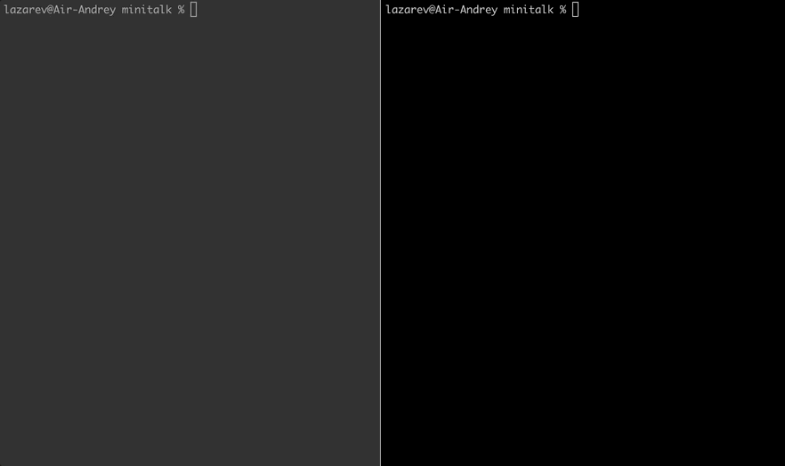

# Проект "Minitalk" :pager:
[](https://forthebadge.com)
[](https://forthebadge.com)
[](https://forthebadge.com)

### Описание проекта
Привет, мир :wave:

Этот проект представляет собой мини-чат обмена данными между двумя [процессами](https://en.wikipedia.org/wiki/Process_(computing)): клиентом и сервером.
Сначала запускается сервер, после чего он отображает свой [PID](https://en.wikipedia.org/wiki/Process_identifier).
Клиент принимает в качестве параметров PID сервера и отправляемое сообщение.
Как только строка будет получена сервером, он ее отображает.

Взаимосвязь между клиентом и сервером осуществляется только с использованием двух пользовательских [сигналов Unix](https://en.wikipedia.org/wiki/Signal_(IPC)): SIGUSR1 и SIGUSR2.
Таким образом, каждый символ отправляется с помощью 8 сигналов, которые являются представлением этого символа в двоичной системе счисления.

### Демонстрация


### Запуск
Клонирование и компиляция:
```bash
git clone https://github.com/Dronoti/minitalk.git minitalk && cd minitalk && make && make clean
```
Исполняемые файлы называются client и server, их необходимо запустить по отдельности:
```bash
./server
```
```bash
./client
```

### Дополнительно
Подробная функциональность программы, ограничения и требования к ее реализации описаны в [задании.](./minitalk.pdf)